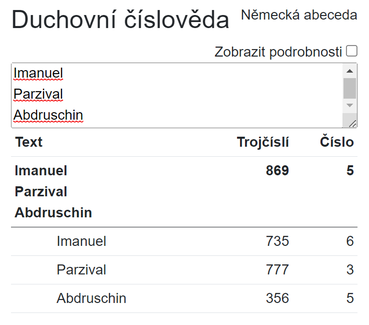

# Numerolog - duchovní číslověda

Numerologie německého jazyka duchovně přijatá Lucienem Siffridem a Hermannem Wenngem z kruhu Pána Abdrushina.
- Původní [abeceda](Numerology/Alphabets.cs#:~:text=static%20readonly%20Alphabet-,German,-%3D%20new()) byla rozšířena o písmeno ß s číselnou hodnotou dvou s = 1 + 1 = 2.

Aplikace je dostupná na adrese https://numerolog.vzestup.net:

## Souvislosti

Aplikace byla použita na výpočet [výstavby Poselství Grálu](https://abdrushin.one/cs/poselstvi_gralu/1931/vystavba#numerologie).

Existuje podobná a propracovanější aplikace od Juraje Sitára [Nová Numerológia Slovenov - Nová Slovenská číslovéda](https://yaspis.sk/programy-jaspis#:~:text=Nov%C3%A9%20Hodiny%20Slovenov%C2%A0%20%C2%BB-,Nov%C3%A1%20Numerol%C3%B3gia%20Slovenov,-%2D%20Nov%C3%A1%20Slovensk%C3%A1%20%C4%8D%C3%ADslov%C3%A9da).
- Nepodporuje německé znaky Ä, Ü, Ö, ß.

## Historie

- 2023.5.7
  - zveřejnění první verze

## Technologie

ASP.NET Core Blazor WebAssembly.

## Licence

Použití aplikace a zdrojového kódu v souladu s Božími zákony.
